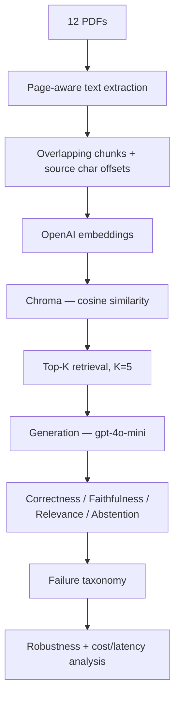

# LLMEvalIQ

A statistically disciplined evaluation framework for RAG systems over real-world financial documents.

**Document recall was already 100% at K=5 while evidence coverage was only ~19–20%. A controlled chunk-size experiment improved evidence coverage and nearly doubled mean end-to-end correctness (10.7% → 20.0%, from three independent generation runs per configuration).**

📄 **Full technical report:** [`reports/FINAL_REPORT.md`](reports/FINAL_REPORT.md) — the complete research write-up this README summarizes.

---

## Problem

Two RAG systems can look identical from the outside — both produce fluent, confident paragraphs. Fluency is not accuracy, and a naive evaluation ("did it retrieve the right document?") can pass a system that almost never finds the actual answer.

This project builds a small RAG system over 12 real annual reports (3,129 pages) and spends most of its effort on **the instruments used to measure whether it works**: a group-aware gold evidence set, a validated LLM judge, a pre-registered chunk-size experiment, a 3-run robustness check against generator non-determinism, a failure taxonomy, and a cost/latency analysis — each one built because the simpler version before it was found to be misleading.

## Key Results

| | Baseline (500) | Winner (600) |
|---|---|---|
| Gold Span Coverage@5 | 19.7% | **23.9%** (+21.3% relative) |
| Correctness (mean of 3 runs) | 10.7% (range 8–12%) | **20.0%** (range 16–24%) |
| Faithfulness (mean of 3 runs) | 84.0% | **92.0%** |
| Cost per correct answer | $0.00129 | **$0.00080** |

The chunk-size winner (600 characters) was selected by a **pre-registered rule** — Gold Span Coverage@5, decided before any generation was run — specifically so the choice couldn't be reverse-engineered from results that looked good afterward. Document Recall was **not** used to select it: it read 100% for every configuration tested and had no discriminating power.

**The win is not free.** The winning configuration uses ~18% more input tokens per generation call, introduces failure cases the baseline didn't have (`unsupported_correct` — a correct answer with no traceable retrieved support), and has its own documented regression (q021 — a case where a neighbouring data table outranks the chunk that actually contains the answer). All of this is in the report, not edited out because the aggregate number was favorable.

## Architecture



One concept per file: `src/ingestion.py` (PDFs → chunks → embeddings → vector store), `src/retrieval.py` (question → top-K chunks), `src/generation.py` (chunks + question → answer), `src/evaluation.py` (judges all of the above — never modifies an answer).

## Evaluation Methodology

Correctness/faithfulness/relevance are judged by a second LLM call, majority-of-3 voting, **checked against manual review labels before being trusted** (correctness 100%, faithfulness 92%, relevance 100% agreement — a 25-question smoke test, described here as exactly that, not as a calibrated production judge).

Gold evidence uses **groups with alternative valid locations**, not a single fixed answer span: a fact that appears twice in a report (e.g. once in a Directors' Report, once in an MD&A) is one required *group* with two *alternatives* — finding either satisfies it, and finding both earns no extra credit. This was built after a simpler one-location-per-fact design was found to unfairly fail correct retrieval. Full design rationale, including why plain text-substring matching was insufficient, is in the report (§4).

## Failure Taxonomy

Every generated answer lands in exactly one of six categories, split first on whether the evidence was actually retrieved (the fix for a retrieval failure and a generation failure are different things):

| | Evidence retrieved | Evidence NOT retrieved |
|---|---|---|
| **Answer correct** | `grounded_correct` | `unsupported_correct` ⚠️ (never counted as a win) |
| **Answer wrong** | `generation_failure` / `generation_refusal` | `retrieval_failure_honest` / `retrieval_failure_hallucinated` |

`unsupported_correct` — a right answer with no traceable support — is the training-data-contamination-risk quadrant. It exists in this project's results (5 of 75 answers at the winning configuration) and is reported as a limitation, not banked as a success.

## Experiment Design

1. **Phase 5** — frozen retrieval baseline at chunk_size=500. Finding: Document Recall 100% vs Evidence Coverage 19% at K=5.
2. **Phase 6** — generation baseline. Finding: faithfulness ≠ correctness; generator is non-deterministic across identical re-runs.
3. **Phase 7A** — chunk-size sweep (300/500/600/1000), retrieval-only, pre-registered selection rule, no generation calls.
4. **Phase 7B** — 3 independent end-to-end generation runs per config (500 vs 600), to separate a real configuration effect from generation noise.
5. **Phase 8** — failure analysis, sliced by document/difficulty/question-type, with explicit small-sample warnings.
6. **Phase 9** — cost, latency, token-usage analysis, with pricing verified and dated (not assumed).

## Results

Full tables, per-run breakdowns, case studies, and the complete limitations list are in [`reports/FINAL_REPORT.md`](reports/FINAL_REPORT.md). This README intentionally does not duplicate them.

## Dashboard

An offline, read-only view of the completed experiment — loads only from `results/*.csv`, makes **no** API calls, builds **no** index, and needs **no** `OPENAI_API_KEY`:

```bash
streamlit run app/dashboard.py
```

Tabs: Executive Overview, Retrieval, Generation Robustness, Failure Taxonomy, Case Studies (q020/q021/q023), Efficiency, Methodology & Limitations.

## Repository Structure

```
LlmEvaluation/
├── README.md
├── reports/FINAL_REPORT.md     # full technical report
├── app/dashboard.py            # offline Streamlit dashboard
├── requirements.txt
│
├── data/
│   ├── documents/               # source PDFs (gitignored — large)
│   └── evaluation/               # gold questions/evidence/spans (committed)
│
├── src/
│   ├── ingestion.py              # PDFs -> chunks -> embeddings -> vector store
│   ├── retrieval.py               # question -> top-K chunks
│   ├── generation.py              # chunks + question -> answer
│   └── evaluation.py              # judges (correctness/faithfulness/relevance/taxonomy)
│
├── scripts/                      # one script per phase (build index, measure, analyze)
├── notebooks/                    # corpus curation, gold-set construction
├── tests/
└── results/                      # durable evaluation artefacts (committed — this IS the deliverable)
```

## Quickstart

```bash
git clone https://github.com/milanrawal132-nn/LlmEvaluation.git
cd LlmEvaluation
python3 -m venv .venv && source .venv/bin/activate
pip install -r requirements.txt
```

**View the completed experiment — no API key needed:**
```bash
streamlit run app/dashboard.py
```

**Run the offline test suite — no API key needed:**
```bash
pytest -q
```

**Reproduce the pipeline from scratch** (needs `OPENAI_API_KEY` in `.env`, copied from `.env.example`): see [`reports/FINAL_REPORT.md` §16](reports/FINAL_REPORT.md#16-reproducibility) for exact commands to build an index, run retrieval evaluation, and run generation evaluation.

## Tests

```bash
pytest -q                 # offline suite — no API key required
pytest -m judge -q        # judge-behaviour tests — needs OPENAI_API_KEY, opt-in only
```

The default suite excludes judge/API tests via `pytest.ini`'s marker config, so `pytest -q` alone never makes a network call.

## Limitations

- 25-question pilot gold set, evidence anchored in only 3 of the 12 corpus documents
- One embedding model, one generation model, four chunk sizes tested
- No formal statistical significance test anywhere — non-overlapping 3-run ranges are reported descriptively, not as a p-value
- No retrieval query-latency benchmark (only generation latency was captured)
- Faithfulness judge agreement with manual review is 92%, not 100%
- Manual review labels are **AI-assisted manual review**, not independent blinded human annotation
- `unsupported_correct` cases exist — training-data recall is an observed risk, not a theoretical one

Full list with detail: [`reports/FINAL_REPORT.md` §14](reports/FINAL_REPORT.md#14-limitations).

## Future Work

Reranking, hybrid BM25 + embedding retrieval, table-aware chunking, alternate embedding models, a larger stratified gold set, independent (non-AI-assisted) human annotation, and a retrieval query-latency benchmark. Detail and rationale for each: [`reports/FINAL_REPORT.md` §15](reports/FINAL_REPORT.md#15-what-i-would-test-next).

---

**Secrets:** `.env` holds your real key and is gitignored. `.env.example` is a committed template — never put a real key there.
