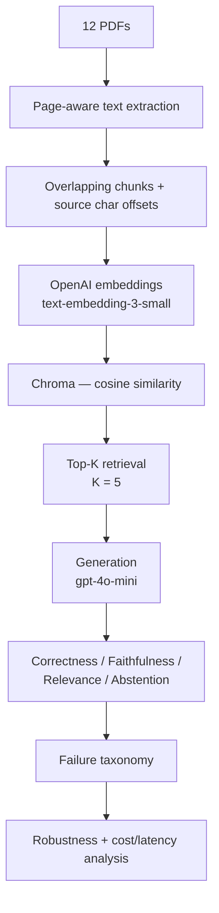

# LLMEvalIQ — Final Technical Report

**A statistically disciplined evaluation of a RAG system over 12 real annual reports.**

All numbers in this report are read from `results/*.csv` and `results/*.md`, produced by Phases 5–9. Nothing here is re-derived or estimated. Where a number depends on a small sample, that is stated next to it, not left implicit.

---

## 1. Executive Summary

This project built a small Retrieval-Augmented Generation (RAG) system over 12 real Indian company annual reports (3,129 pages) and then spent most of its effort not on the RAG system, but on the **instruments used to evaluate it**.

That emphasis is the point. A RAG system is easy to build and easy to over-trust. The first honest measurement here — **Document Recall was 100% while Evidence Coverage was only ~19–20%** — shows why: the system almost always fetched *a page from the right report*, but usually not *the specific passage needed to answer the question*. A naive evaluation that only checks "did it find the right document" would have reported this system as working. It wasn't.

From that starting point, the project ran a controlled chunk-size experiment (300 / 500 / 600 / 1000 characters), selected a winner *before* looking at generation quality (chunk_size=600, chosen on Gold Span Coverage@5), and then verified the win survived contact with a non-deterministic generator across three independent runs. It did: **mean end-to-end correctness roughly doubled (10.7% → 20.0%)**, with observed ranges (8–12% vs 16–24%) that don't overlap.

**Final accepted configuration:** chunk_size=600, overlap=50, `text-embedding-3-small`, cosine distance, TOP_K=5, generation model `gpt-4o-mini`.

**Strongest limitations, stated up front:** this is a 25-question pilot over 3 of the 12 documents' gold questions, with 3 generation runs — not a statistically powered benchmark. The LLM judge was checked against manual (AI-assisted) review labels on those same 25 questions, not independently, blindly re-annotated by a second human. Both are named explicitly throughout this report rather than glossed over.

---

## 2. Research Question

**Can a RAG system reliably retrieve and answer factual questions from large, messy annual reports, and how do retrieval configuration, generation variance, grounding, latency, and cost interact?**

Four sub-questions this report actually answers with evidence:
1. Does finding the right *document* mean the system found the right *evidence*? (No — Phase 5.)
2. Does a controlled retrieval change move a metric that was already saturated, or one that wasn't? (Chunk size moved Evidence Coverage; Document Recall was already maxed out — Phase 7A.)
3. Does a retrieval-only improvement survive into end-to-end generation quality, given that generation itself is noisy? (Yes, but not uniformly — Phase 7B.)
4. Where do the remaining failures concentrate, and what do they cost? (Phases 8–9.)

---

## 3. Dataset / Corpus

| | |
|---|---|
| Documents | 12 annual reports, Indian public companies, FY2024-25 and FY2025-26 |
| Total pages | **3,129** (pypdf-verified) |
| Companies | Alivus, Alu Wind, Ecoplast, Ganesh, Goa Carbon, Infosys, Mahindra, Reliance, Rishiroop, Sayaji, Sumit, Tata Motors |
| Page-count range | 73 pages (Alu Wind) to 590 pages (Tata Motors) |

**The gold evaluation set is a 25-question pilot, not a benchmark.** Its evidence is anchored in only **3 of the 12 documents** — Ecoplast, Goa Carbon, and Infosys — chosen for readability and diversity of question type, not sampled to represent the full corpus. Numbers in this report that break down "by document" describe those 3 companies specifically; the other 9 serve only as retrieval distractors. This is stated once here and should be assumed throughout — not overstated as corpus-wide coverage anywhere below.

| Gold set | |
|---|---|
| Questions | 25 |
| Evidence rows | 35 |
| Evidence groups | 30 |
| Question types | numeric (13), comparison (5), descriptive (4), entity (2), date (1) |
| Difficulty | easy (17), medium (5), difficult (3) |

---

## 4. Gold Evaluation Design

### The problem with row-level text matching

The evaluation design went through several corrections, each triggered by a real defect the previous version produced:

**One-to-many evidence.** A question can require several distinct facts (e.g. q010 needs four segment-risk disclosures). A single `evidence_text` field per question can only prove one of them was found — this became `evidence.csv`, one row per required fact.

**The q010 / q019 duplicated-evidence problem.** Two distinct issues surfaced under closer inspection:
- **q019**'s EPS figure (₹71.58) appears *twice* in the Infosys report — once in a ratios table, once in the consolidated statement. Retrieving either one fully answers the question. Scoring both as required (and 0.5 for finding one) unfairly punished correct retrieval.
- **q010**'s four segment-risk facts each appear *verbatim on two different pages* (p.43 Directors' Report, p.70 MD&A). A single fixed "correct location" would fail the system for retrieving the *other, equally valid* copy.

Both are the same underlying shape: **some facts have more than one valid location.** The fix was **evidence groups** — one group per *required fact*, with multiple *alternative locations* inside a group, scored by:
- **within a group:** `max` over alternatives (finding either copy fully satisfies the requirement — a duplicate is not extra credit, and its absence is not a deduction)
- **across groups:** `ALL` (every required fact needed, the default) or `ANY` (any one group sufficient — used only where the question is genuinely satisfied by one of several independent facts, e.g. q019)

```
question ──evidence_mode──▶ required GROUPS (facts)
                                │
                                └── max ──▶ alternative SPANS (valid locations)
```

### Why row-level text matching was insufficient

Even with groups, matching evidence by *text substring inside one chunk* has a structural flaw: **the ruler changes shape with the thing it measures.** A snippet longer than the chunk overlap can straddle a chunk boundary and sit inside *no single chunk* — at chunk_size=300, this made 6 of the gold snippets structurally unfindable regardless of retrieval quality; at chunk_size=600, 4 were.

The fix was **fixed source-document character offsets** (`evidence_spans.csv`), derived — never hand-typed — from the already-verified evidence text via a normalised-to-raw offset mapping, each one validated by round-tripping back through the source PDF text. Coverage is then computed over the **union** of retrieved chunks' offset ranges, so a fact split across two adjacent retrieved chunks correctly counts as found — something no version of substring matching could ever do.

### Ruler-quality checks

Before any retrieval number was trusted, an `unfindable_evidence()` check ran against the actual built index: **0 of 35 evidence rows, 0 of 30 groups, were unreachable at any of the four tested chunk sizes.** This check is not cosmetic — it is what makes the chunk-size comparison in Section 9 valid at all.

---

## 5. System Architecture



**Provenance is preserved end to end.** Every chunk carries its source document, page numbers, and character offsets from extraction through to the final answer — this is what makes it possible to trace a wrong answer back to the exact PDF page that produced it, and what makes the evidence-span metrics in Section 4 possible at all.

---

## 6. Frozen Baseline — Phase 5

Measured at chunk_size=500 / overlap=50 (the original baseline before any tuning), text-substring ruler:

| K | Document Recall | Any Evidence Recall | Evidence Coverage |
|---|---|---|---|
| 1 | 92.0% | 20.0% | 15.0% |
| 3 | 100.0% | 20.0% | 15.0% |
| **5** | **100.0%** | **24.0%** | **19.0%** |
| 10 | 100.0% | 32.0% | 27.0% |

**The main insight:** *retrieving the correct document is not the same as retrieving the evidence needed to answer the question.* At K=5, the system reaches the right 590-page-or-so report **every time** — and finds the actual required passage only about **one time in five**. Document Recall saturates almost immediately (92%→100% between K=1 and K=3) and stays there; it is the generous, nearly-useless half of the picture. Evidence Coverage is the honest half, and it never gets close to saturating in this range.

---

## 7. Generation Baseline — Phase 6

With retrieval this weak, generation correctness was **very low** (8% single-run) — the ceiling generation could reach was already capped by what retrieval had found. **Abstention was correspondingly high (52%)**: the system prompt instructs the model to say "I don't know" rather than guess, and it frequently did — a *correct* behaviour on a bad retrieval, not a failure.

**Faithfulness ≠ correctness**, demonstrated concretely by q020: *"What was the Infosys operating margin?"* The model answered **25.3%** (reference: 20.3%) — faithful (grounded in the retrieved context) *and* relevant (on-topic) *and* wrong. Faithfulness verifies the claim is *in the context shown*, not that the *right* context was retrieved; it cannot catch a wrong-but-plausible-looking passage.

**q021 is a clean generation failure with retrieval succeeding**: the correct page was retrieved, and the model still hallucinated "won 2 clients" against a true value of 443 — while getting the paired fact (client base = 1,965) right.

**Generator non-determinism was found and is the reason for the 3-run robustness design (Phase 7B).** Re-running the *same* pipeline on the *same* index produced different answer wording for 9 of 25 questions, and in one case (q018) flipped a full taxonomy label between a confident hallucination and an honest abstention. A single generation run cannot distinguish a real configuration effect from this baseline noise — which is exactly why Phase 7B exists.

---

## 8. Judge Validation

Correctness, faithfulness, and relevance were judged by a second LLM call (`gpt-4o-mini`, majority-of-3 voting) rather than compared by string matching. Before trusting that judge's numbers, it was checked against manual review labels on the same 25 questions:

| metric | agreement |
|---|---|
| correctness | 100% |
| faithfulness | **92%** |
| relevance | 100% |

**This is a 25-question manual-review smoke test — not a statistically calibrated production judge.** The manual labels themselves are **AI-assisted manual review**, not an independent blinded human annotation; describing them otherwise would overstate their evidentiary weight, and this report does not.

Two faithfulness disagreements remain, deliberately *not* tuned away:
- **q010** — judge said faithful, reviewer said no (reviewer's read: the answer's mitigation wording exceeds what the retrieved context actually supports).
- **q019** — judge said unfaithful, reviewer said yes (reviewer's read: the EPS figure was directly and correctly supported).

Both are retained as documented judge limitations rather than adjusted post hoc — adjusting the rubric until it agrees with every human call would defeat the purpose of checking it.

---

## 9. Chunk-Size Experiment — Phase 7A

Four configurations tested: chunk_size ∈ {300, 500, 600, 1000}, overlap fixed at 50, same embedding model, same corpus. **Selection was pre-registered**: the winner would be chosen by **Gold Span Coverage@5** *before* any generation was run, specifically to prevent picking a config that merely looked good after the fact.

| chunk_size | Document Recall@5 | Gold Span Any Recall@5 | **Gold Span Coverage@5** | chunks | index size | build time |
|---|---|---|---|---|---|---|
| 300 | 100.0% | 20.0% | 21.3% | 41,093 | 388.3 MB | 900.9s |
| 500 (baseline) | 100.0% | 24.0% | **19.7%** | 22,832 | 259.1 MB | 552.9s |
| **600 (winner)** | 100.0% | 20.0% | **23.9%** | 18,682 | 222.9 MB | 491.7s |
| 1000 | 100.0% | 20.0% | 19.6% | 10,819 | 189.5 MB | 307.6s |

**600 won: 23.9% vs 500's 19.7% — a relative improvement of approximately +21.3%.**

**Document Recall was deliberately not used to select the winner.** It reads 100.0% for every single configuration in this table — it has zero discriminating power here, for the same reason it was the misleading half of the Phase 5 finding. Selecting on a saturated metric would have been arbitrary.

**q021 is reported here as a regression, not hidden.** A later deep-dive (Section 10) found that at chunk_size=600, the chunk containing q021's answer is retrieved but ranks below a neighbouring, semantically similar but factually *wrong* table — a finding that belongs in this section as an honest cost of the winning configuration, not edited out because the aggregate metric still favoured 600.

---

## 10. End-to-End Robustness — Phase 7B

The Phase 7A winner (600) was compared against the frozen baseline (500) using **three independent generation runs per configuration** — not three judge votes on one answer, three separate calls to the generator, because Section 7 established that the generator itself is non-deterministic.

| | 500 (baseline) | 600 (winner) |
|---|---|---|
| Correctness | mean **10.7%**, range 8–12% | mean **20.0%**, range 16–24% |
| Faithfulness | mean 84.0%, range 80–88% | mean 92.0%, range 92–92% |
| Relevance | mean 98.7%, range 96–100% | mean 100.0%, range 100–100% |
| Abstention | mean 56.0%, range 52–60% | mean 64.0%, range 64–64% |

**The observed ranges for correctness and faithfulness do not overlap between configurations.** This is reported descriptively — it means the difference survived the run-to-run noise actually measured in this experiment. **It is not a formal statistical significance claim**; with n=3 runs there is no p-value computed or implied anywhere in this project.

**Taxonomy shift, pooled across all 3 runs × 25 questions per config (75 observations each):**

| label | 500 | 600 |
|---|---|---|
| grounded_correct | 8 (10.7%) | 10 (13.3%) |
| generation_failure | 9 (12.0%) | 5 (6.7%) |
| retrieval_failure_honest | 41 (54.7%) | 48 (64.0%) |
| retrieval_failure_hallucinated | 16 (21.3%) | 7 (9.3%) |
| **unsupported_correct** | **0** | **5 (6.7%)** |

Hallucinated retrieval failures fell sharply (21.3%→9.3%), and generation failures fell too (12.0%→6.7%). But 600 also **introduced** `unsupported_correct` cases that 500 had none of.

**`correct` and `grounded_correct` are not the same thing, and this project never treats them as interchangeable.** `correct` means the answer matched the reference. `grounded_correct` means it *also* came from retrieved evidence the system actually surfaced. The gap between them (600: 15 `correct` vs 10 `grounded_correct`) is exactly the 5 `unsupported_correct` cases — answers that were right without traceable support, most plausibly because `gpt-4o-mini` already knows public facts about Ecoplast's business segment or Infosys's published training statistics from pretraining, not because the pipeline retrieved them. These are never counted as pipeline wins in any aggregate in this project.

---

## 11. Failure Analysis — Phase 8

**Aggregate taxonomy answers HOW MANY. Slice analysis answers WHERE** — and where a failure concentrates determines what fixing it would actually require.

| document | n questions | worst over-represented failure |
|---|---|---|
| **Goa Carbon** | 8 | **retrieval_failure_honest — 100%**, 1.6x overall rate |
| **Infosys** | 7 | **retrieval_failure_hallucinated — 33%**, 3.6x overall rate |
| Ecoplast | 10 | generation_failure — 17%, 2.5x overall rate |

**Goa Carbon: every single observation across all 3 runs was an honest abstention.** This traces back to Phase 5 — Goa Carbon's gold-answer chunks scored *below the general distractor floor* (0.38–0.58 vs the corpus's typical 0.55–0.72), so the retriever never surfaces them at any of the tested chunk sizes. This is a document-specific weakness, most plausibly in how that PDF's text extracted, not a corpus-wide problem.

**Infosys hallucinates rather than abstaining**, unlike Goa Carbon — a qualitatively different failure mode from the same document set, driven by tables that read as topically confident even when their specific numbers are wrong (see q020, q021 case studies).

**Ecoplast concentrates on the generation side** rather than retrieval — the evidence is usually found, but the model still gets it wrong.

**Small-sample warning, stated explicitly and not overinterpreted:** the `question_type` breakdown includes categories with n≤4 distinct questions (`entity` n=2, `date` n=1, `descriptive` n=4). A 100% failure rate on n=1 is one question's outcome repeated three times, not a category-wide finding, and this report does not treat it as one.

---

## 12. Cost / Latency / Efficiency — Phase 9

Three separate questions, kept explicitly separate rather than collapsed into one "is it more efficient" verdict:

**Retrieval infrastructure — 600 is better, on every axis measured:**

| | 500 | 600 | change |
|---|---|---|---|
| chunks | 22,832 | 18,682 | −18.2% |
| index size | 259.1 MB | 222.9 MB | −14.0% |
| build time | 552.9s | 491.7s | −11.1% |

**Generation token consumption — 500 is cheaper per call:**

Mean input tokens/answer: 500 = 847.4, 600 = 998.7 (+17.9%). Larger chunks retrieved at TOP_K=5 put more raw text into every prompt — measured directly, not inferred. Mean cost/answer: 500 = $0.000138, 600 = $0.000160.

**Outcome efficiency — 600 is cheaper per correct answer:**

| | 500 | 600 |
|---|---|---|
| cost per correct answer | **$0.00129** | **$0.00080** |

600 spends more per API call but wastes far fewer of those calls on wrong answers, so total spend per correct answer is lower. n=8 correct answers at 500 and n=15 at 600 — both figures are directional at this sample size, not precise to the third decimal.

**Retrieval query latency was not captured during Phase 7A and is not reported anywhere in this project.** Generation latency (which was captured) showed no material difference between configs — the observed −0.05s mean delta is smaller than either config's own run-to-run standard deviation (0.32–0.51s).

**Pricing note:** gpt-4o-mini pricing ($0.15/1M input, $0.60/1M output) was verified against OpenAI's official pricing page on **2026-08-15**. These rates are not permanent — anyone reusing this analysis later should re-verify before trusting the dollar figures, even though the token-count figures remain valid indefinitely.

---

## 13. Major Findings

**A.** 100% Document Recall can coexist with ~20% Evidence Coverage — reaching the right report and finding the right passage in it are different events, and only the second one determines whether the system can actually answer.

**B.** Chunk-size tuning moved Evidence Coverage meaningfully (19.7%→23.9%) while Document Recall stayed pinned at 100% throughout — a controlled experiment only has something to say about the metric that wasn't already saturated.

**C.** Better evidence retrieval improved end-to-end correctness (10.7%→20.0%, non-overlapping observed ranges) — but not uniformly; q021 got *worse* under the winning configuration even as the aggregate improved.

**D.** Faithfulness and correctness measure different failure modes — q020 is faithful, relevant, and wrong, all three at once, which no single metric could have surfaced.

**E.** A model can return the correct answer with no retrieved support — 5 of 75 `600`-configuration answers were `unsupported_correct`, most plausibly the generator's own pretraining knowledge rather than the pipeline working.

**F.** Embedding similarity can rank a semantically adjacent but factually wrong table above the prose that actually answers the question — q021's root cause, confirmed by direct embedding comparison (the answer-bearing chunk scored 0.50; a neighbouring client-tier table scored 0.65, well above it).

**G.** The better retrieval configuration can cost more per API call and less per successful answer, simultaneously — 600 is 17.9% more expensive in mean input tokens per call, and roughly 38% cheaper per correct answer, because far fewer of its calls are wasted.

---

## 14. Limitations

- **25-question pilot gold set** — not a statistically powered benchmark by any standard.
- **Gold evidence anchored in only 3 of the 12 corpus documents** (Ecoplast, Goa Carbon, Infosys) — document-level findings describe those 3 companies, not the full corpus.
- **One embedding model** (`text-embedding-3-small`) — findings about chunk size are specific to this model's embedding geometry and may not transfer to another.
- **One generation model** (`gpt-4o-mini`) — correctness/faithfulness/abstention numbers are specific to this model.
- **Only four chunk sizes tested** (300/500/600/1000) — the true optimum, if a finer sweep were run, could lie between tested points.
- **Fixed overlap (50) and fixed TOP_K (5)** for every experiment — neither was varied, so their individual contribution is untested.
- **No formal statistical significance test anywhere** — non-overlapping ranges across 3 runs are reported descriptively, deliberately not as a p-value or confidence interval.
- **No retrieval query-latency benchmark** — only generation latency was measured.
- **Faithfulness judge agreement is 92%, not 100%** — faithfulness-derived numbers (including `grounded_correct` counts) carry that residual uncertainty.
- **Human-review labels are AI-assisted manual review**, not independent blinded annotation by a second person — described as such throughout, never as "human validation" without qualification.
- **Training-data recall / contamination risk is real and observed**, not theoretical: `unsupported_correct` cases exist at the winning configuration (5/75) and are never counted as retrieval or generation wins.
- **Annual reports are a specialized, number-dense, table-heavy document domain** — findings here (e.g. the table-vs-prose embedding effect in Finding F) may be specific to this domain and not generalize to prose-heavy corpora.

---

## 15. What I Would Test Next

*(Future work — not executed in this project.)*

- A **reranker** stage after initial retrieval, specifically to address Finding F (tables outranking correct prose).
- **Hybrid BM25 + embedding retrieval**, since exact numeric/table lookups (Goa Carbon's weakness) are a classic case where sparse retrieval complements dense embeddings.
- **Query expansion or query rewriting**, to test whether the client-tier-table confusion in q021 is a query-phrasing artifact.
- **Table-aware chunking or extraction** — treating tables as first-class structured units rather than flattened text, given how much of this project's failure analysis traces back to table handling.
- **Alternate embedding models**, to check whether Finding F (table-over-prose ranking) is specific to `text-embedding-3-small` or a more general property of dense embeddings on financial tables.
- **A larger, stratified gold set** — enough questions per document and per question-type to retire every small-sample warning in Section 11.
- **Independent human annotation** — a second annotator, blind to the judge's verdicts and to the first reviewer's labels, to produce a genuinely independent faithfulness-agreement number.
- **A retrieval query-latency benchmark**, filling the one metric explicitly not captured anywhere in this project.

---

## 16. Reproducibility

No step below requires an OpenAI API key merely to **view** the historical results in `results/` or run the dashboard.

**Install:**
```bash
python -m venv .venv && source .venv/bin/activate
pip install -r requirements.txt
```

**Run the offline test suite** (no API key needed — 133+ tests, judge/API tests excluded by default):
```bash
pytest -q
```

**Run judge-behaviour tests** (needs `OPENAI_API_KEY` in `.env`, costs a small amount):
```bash
pytest -m judge -q
```

**Derive the gold evidence spans** (needs the source PDFs in `data/documents/`, no API key):
```bash
python scripts/derive_gold_spans.py
```

**Build a retrieval index** (needs `OPENAI_API_KEY`, costs a small amount, ~5–15 minutes):
```bash
python scripts/build_index.py --chunk-size 600 --overlap 50
```

**Run the retrieval-only evaluation** against a built index (needs `OPENAI_API_KEY` for query embedding, no generation cost):
```bash
python scripts/measure_retrieval.py
```

**Run the end-to-end generation evaluation** against a built index (needs `OPENAI_API_KEY`, generation + judging cost):
```bash
python scripts/measure_generation.py --repetitions 3
```

**View the completed experiment without any of the above** (no API key required):
```bash
streamlit run app/dashboard.py
```
